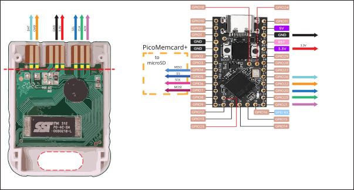
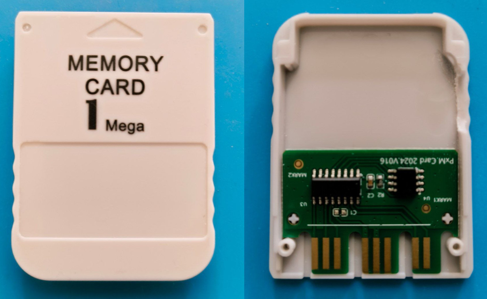
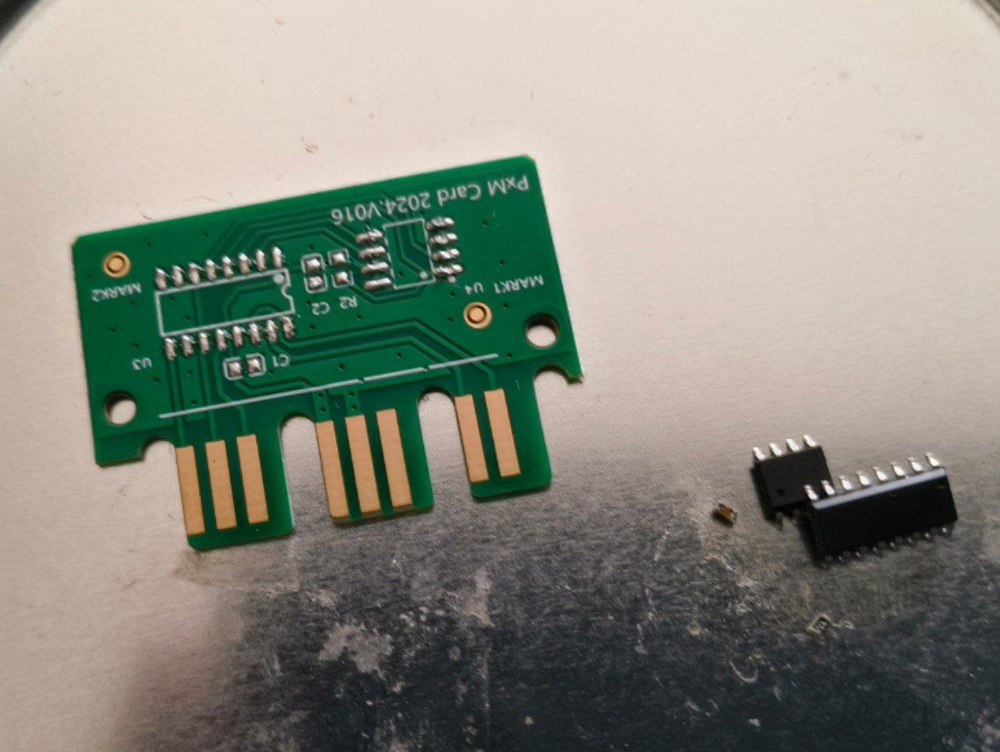
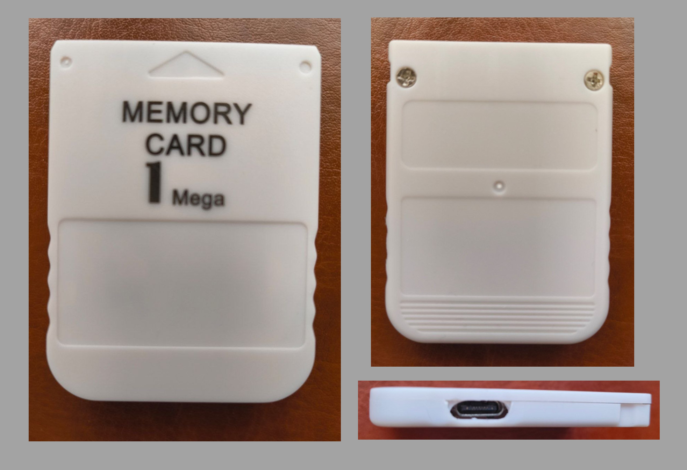

# PicoMemcard++

PicoMemcard++ lets you build a supercharged PlayStation memory card that can connect to your computer via USB, allowing you to transfer save files directly to and from your PSX. It can also be used to repurpose broken or counterfeit memory cards, turning them into something far more capable using only an RP2040. This project is a fork of the original work by [Dangiu].

When I decided to get involved, the original repository was read-only and no longer actively developed. I had a few simple goals in mind:
* There are many very cheap RP2040-based boards with built-in QSPI flash (up to 16MB), which can hold up to 128 virtual PSX memory card images.
* The project had been split into two versions: PicoMemcard (stuck at version 1.0) and PicoMemcard+ (which depends on a microSD card). I thought it made sense to merge them so both could benefit from ongoing updates.
* That’s when my journey with the project began.

## Features
* Able to faithfully simulate PSX Memory Card
* USB connection to import/export saves
* Allows to copy saves to/from any other memory card (using original PSX file manager)
* Allows to play burned CDs (thanks to [FreePSXBoot])
* Cheaper than an original memory card
* Can store hudreds of memory card images

## PicoMemcard++ vs PicoMemcard+/PicoMemcard
Because some features can’t be implemented using only a Pico/RP2040-Zero and require additional hardware, the original project was split into two versions:

* PicoMemcard was inspired by this project and aims to be the simplest and easiest version to build. It only requires a Raspberry Pi Pico, RP2040-Zero, or RP2040-Pro Micro. The original version supported only a single virtual memory card.
* PicoMemcard+ adds support for extra features, such as multiple memory card images, by using an additional SD card. However, this version also requires extra hardware, specifically a MicroSD SPI expansion board.
* **PicoMemcard++** (this fork) brings some of the features from PicoMemcard+ to the original PicoMemcard design, allowing users to switch between different memory cards without needing additional storage hardware. It’s a lower-cost option that combines ideas from both designs.

This approach was chosen because many users want the cheapest possible solution and don’t care about extra features. Others, however, are willing to spend a bit more to gain additional functionality.

Please note that the current release of PicoMemcard++ (when used without an SD card) comes with some limitations:
* Non-transparent write-back: during the synchronization process used to save new data, the memory card may briefly appear to disconnect.
* The connection to the PC (used to transfer save files from PSX games) is not fully plug-and-play. In some cases, you may need to reconnect the device.

## Bill of materials
* ** RP2040 Pico/Zero/Pro Micro** (around 2-3€).
* One of:
    * Custom [PicoMemcard PCB](#picomemcard-pcb)
    * Broken/Counterfeit/Original PSX Memory Card (counterfeit ones can be found on AliExpress for around 2-3€)
    * PSX/PS2 Controller Cable
    * CAT5 network cable and a bit of creativity.

Basically anything that will allow you to interface with the memory card slot pins will do. If you have a broken contoller you can cut off the cable and use that since controllers and memory cards share the same bus. Of course, plugging your memory card into the controller slot will prevent you from using 2 controllers at the same time.

[This guy] assembled one using a 3d-printed plastic shell and simple CAT5 network cable. I belive this is the cheapest method anybody has come up with until now.

In total building a PicoMemcard wil cost you less than buying a used original Memory Card!

## Video

## DIY

Getting your hands dirty, we will explore two different routes:
    * Custom [PicoMemcard PCB](#picomemcard-pcb)
    * [PSX Memory Card] (#picomemcard++-using-memory-card)

### PicoMemcard PCB

These are the custom PCBs designed and manufactured specifically for this application. They are not strictly required but make it much easier to build PicoMemcard since you don't need to cut up another memory card and all the soldering pads are easily accessible. All you need to do is to solder the Pico/RP2040-Zero on top of the PCB using a soldering iron.

The Raspberry Pi Pico or RP2040-Zero must sit flush on top of the PCB, fortunately both the Pico and RP2040-Zero provide castellated holes that are easy to solder directly to the PCB's pads. You can use some electrical tape to hold the board in place while you solder the first pins.

I've created a new version of the original PCBs the major difference are:
* The general size is smaller
* A new micro SD card module is supported. This module is smaller, easier to solder and should solve some of the power related issues that were previously present
* Is fitted for the installation of phisical switches used to switch memory card when PicoMemcard+ is used in systems that do not support switching via controller input (e.g. all PS2 models).

The KiCad and Gerber files are available in the repository. If you want to support the project you can request a PCB [from here]. 
Keep in mind that with the PS2 support release that will eventually happen the PCB may undergo some additional changes before its design is finalized.

### PicoMemcard++ using Memory Card
Raspberry Pi Pico, Pro Micro or RP2040-Zero require different pin usage for full compatibility.

The wiring diagrams below show how to build PicoMemcard by wiring respectively a Pico and an RP2040-Zero to a counterfeit memory card. For the other cases (wiring directly to the PSX or using a controller cable) the pins on Pico and RP2040-Zero are the same, the pinout of the PSX/controller can be found on [psx-spx]. The images show the bottom side of the memory card with the cover removed.

The dashed line on the PCB of the memory card is where you should cut a groove deep enough to disconnect the original circuitry from the traces. The yellow squares above the line indicate where you should scrape away the protective film in order to expose the copper traces and solder the wires onto them.

Finally the area at the bottom of the memory card is where you can cut a hole to feed the wires through connecting them to the Pico.
If you are using an RP2040-Zero you can also cut away part of the original Memory Card circuitry to fit it inside the original shell.

The connections in the PicoMemcard+ area are optional (using the optional MicroSD expansion board). Also remember to connect both ground and power to your SD card module (see [MicroSD Module](#microsd-module-for-picomemcard) section for more information).

#### PicoMemcard++ using a CounterFeit Memory Card without microSD module

In this subsection, I’ll show how to build a very simple version of the device without using an external microSD card. Since I don’t own a 3D printer, I used a counterfeit PSX memory card shell instead. The process involves the following steps:
1. Buy a memory card and unscrew the case:

2. Extract the PCB and desolder the internal components

3. Solder the RP2040-based board to the PCB

4. Enjoy the final result.

### MicroSD Module
There are many variations of MicroSD expansion boards with different pinouts and interfaces. The only requirement for PicoMemcard++ is that the module must provide an SPI interface. SPI interfaces have at least the following pins:
* Chip Select (CS) (sometime also called Slave Select (SS)).
* Clock (SCK or CLK).
* Master Output Slave Input (MISO).
* Master Input Slave Output (MOSI).

In addition you will need to connect power and ground to your module, some modules are design to work with 5V others with 3.3V (or both), luckily for us both voltages are available on Pico and RP2040-Zero as shown in the schematic in the section [above](#picomemcard-using-memory-card). Some module provides additional pins that can be left disconnected.

The new versions of the PCB are designed to use small modules such as this one:

This is mainly due to the following reasons:
* It comes withouth pre-soldered headers which makes it easier to solder onto the PicoMemcard PCB.
* Its smaller form factor allows for more flexibility.
* It should have less power issue than prevously used modules.

A good source for these modules is Aliexpress, in general you can search for `MicroSD SPI Expansion Board` and buy the cheapest one you find.

## Installation
1. Download the latest [release] for your board (Raspberry Pi Pico and RP2040-Zero require different binaries).
2. While pressing the 'BOOTSEL' or 'BOOT' button on your board, plug it into your computer. 
3. Drag and drop the PicoMemcard release onto your Raspberry Pi Pico.
4. PicoMemcard should appear on your PC as a USB drive.
5. Upload a memory card image to your PicoMemcard.

## Transfering Data
Memory card images must be exactly 128KB (131072 bytes) in size. PicoMemcard++ only supports files with `.MCR` extensions. However, `.MCR` and `.MCD` extensions are interchangable and can be converted to one another simply via renaming.
For other file formats, try using [MemcardRex] for converting to the desired output.

* **PicoMemcard** only supports a single image which must be named exactly `MEMCARD.MCR`.
* **PicoMemcard+** supports hundreds of images. Each image must be named `N.MCR` where `N` is an integer number (e.g. `0.MCR`, `1.MCR`...). On boot your previously loaded image will be reloaded, unless it's a fresh card then `0.MCR` will be loaded.
* **PicoMemcard++** supports up to 10 memory card images. As before, the naming convention is `N.MCR`, where `N` is an integer number (e.g. `0.MCR`, `1.MCR`...). n systems with 16MB of flash memory — such as some boards like the RP2040-Pro Micro — the limit is increased to 100 images.

Inside `docs/images` you can find two memory card images. One has a couple of saves on it so you can test if everything works correctly, the other is completely empty.

## Switching/Creating Images
On **PicoMemcard+** you can switch the active memory card image with the following inputs:
* `L1 + L2 + R1 + R2 + DPAD UP` will switch to the next image (e.g from `1.MCR` to `2.MCR`).
* `L1 + L2 + R1 + R2 + DPAD DOWN` will switch to the previous image (e.g from `1.MCR` to `0.MCR`).

Additionally you can create a new empty memory card image (and automatically switch to it) by pressing  `L1 + L2 + R1 + R2 + TRIANGLE`.

**Attention**: this method only works on PSX if the controller used to provide the input is plugged in the same slot as PicoMemcard (exactly under it). Using a controller from a different slot will have no effect.

Additionally this method does not work on PS2 Memory Cards and Controllers are wired on a different bus.

## Syncing Changes
Generally speaking, new data written to PicoMemcard (e.g. when you save) is permanently stored only after a short period of time (due to hardware limitation). The on board LED indicates whether all changes have been stored or not, in particular:
* On RP2040 Pico/Pro Micro the LED will be on when all changes have been saved, off otherwise.
* On RP2040-Zero the LED will be solid when all changes have been saved, red otherwise.

Unlike **PicoMemcard+** that tries to write new changes as soon as possible, **PicoMemcard++** will generally do it only after a period of inactivity (around 5 seconds).

**Attention**: after you save your game, make sure to wait for the LED to be solid before turning off the console otherwise you might lose your more recent progress!

## 3D-Printed Case
I've finally designed a 3D-printable case for the different PicoMemcard PCBs. It helps inserting correctly the PCB and ensuring that the the connection to the PSX is optimal. The same result, albeit more janky, can be achieved using a folded sheet of paper as a spacer.

The cases are designed following a minimalistic approach, they consist of a single piece which holds tightly the PCB using very small clips without requiring any additional hardware. To assemble it, simply slide in the PCB from the back of the case (opposite to the side connecting to the PSX). Cases for the fullsize PCB are designed to support the MicroSD expansion module.

Here is the download for the STL files:
* [Design by DanGiu](https://www.thingiverse.com/thing:5488778)

If you don't like this case you can check out other designs many people have already created! I've not tested them personally but here they are:
* [Design by brik1111](https://www.thingiverse.com/thing:5453156)
* [Design by bbsan2k](https://www.thingiverse.com/thing:5460187)

## Troubleshooting and LED Indicator
Generally speaking the onboard LED will provide a pretty good indication regarding the status of PicoMemcard.

In particular, the RP2040-Zero has RGB LED that provides a more clear output. The Pico on the other hand as only a green LED and different blinking patterns indicate different statuses.

### PicoMemcard++ Status
| Status | Pico | RP2040-Zero
| --- | --- | --- |
| Failed to read SD card | Blinking led  | Red blinking led
| Data not fully synced (do not turn off PSX)| Led off | Red led (or flashing red) |
| Data synced | Led on | Solid led |
| Memory Card image changed | Three fast blinks | Single blue blink |
| Memory Card image not changed (end of list) | Nine fast blinks | Single orange blink |
| New Memory Card image created | Multiple very fast blinks | Single light blue blink |

## General Warnings
I would recommend to never plug PicoMemcard both into the PC (via USB) and the PSX at the same time! Otherwise the 5V provided by USB would end up on the 3.3V rail of the PSX. I'm not really sure if this could cause actual damage but I would avoid risking it.

If you really need to have the Pico plugged into both the USB and PSX (e.g. for debugging purposes), disconnect the 3.3V line from the VBUS pin. In this way you can power on the Pico using a simple USB phone charger or by plugging it into your PC.

As a disclamer, I don't take any responsability for what will happen to your console when using PicoMemcard/PicoMemcard+.

## Project Updates
### 16 may 2026
A fork of the original project that revives and merges previously abandoned features, along with updated documentation and support for additional boards and functionalities.

### 5 February 2023
Sorry everybody but I've been quite inactive on the project lately. Due to a change of job IRL I have less time to work for the moment.
Anyway, behind the scenes I've been trying to add support for PS2 memory card but I'm afraid that will require the addition of an extra hardware component unless I am able to develop an efficient cacheing mechanisms or something similar. Anyway I'll keep working on it when I have free time. I have in mind many improvement for the project and I think the future of it is going to be exciting.

Special thanks to everybody that supported it so far! You are all amazing.

## Design
For people interested in understanding how PicoMemcard works I provide a more extensive explanation in [this post] (although now somewhat outdated).

## Thanks To
* [psx-spx] and Martin "NO$PSX" Korth - PlayStation Specifications and documented Memory Card protocol and filesystem.
* [Andrew J. McCubbin] - Additional information about Memory Card and Controller communication with PSX.
* [littlefs] - Filesystem designed to work on NOR flash used by many microcontrollers, including the Raspberry Pi Pico.
* [ChaN FatFS] - FAT filesystem implementation for embedded devices.
* [Scoppy] - Use your Raspberry Pi Pico as an oscilloscope, very cheap and accurate. Without this I would have not been able to debug many issues.
* [PulseView] - Used to import, visualize and manipulate the data from Scoppy on a PC.

[Dangiu]: https://github.com/dangiu/PicoMemcard
[FreePSXBoot]: https://github.com/brad-lin/FreePSXBoot
[psx-spx]: https://psx-spx.consoledev.net/pinouts/#controller-ports-and-memory-card-ports
[Andrew J. McCubbin]: http://www.emudocs.org/PlayStation/psxcont/
[littlefs]: https://github.com/littlefs-project/littlefs
[ChaN FatFS]: http://elm-chan.org/fsw/ff/00index_e.html
[Scoppy]: https://github.com/fhdm-dev/scoppy
[PulseView]: https://sigrok.org/wiki/PulseView
[release]: https://github.com/dangiu/PicoMemcard/releases/latest
[this post]: https://dangiu.github.io/2022/05/13/picomemcard.html
[from here]: https://forms.gle/f6XHtz6W5fn5qDZV7
[This guy]: https://github.com/MrSVCD/PicoPSX_3D
[MemcardRex]: https://github.com/ShendoXT/memcardrex